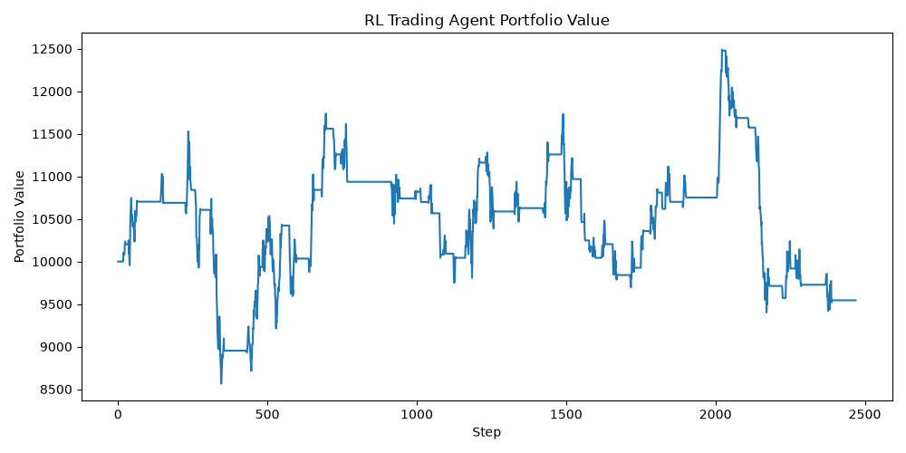

# RL Trading Agent

An interactive reinforcement learning project where an agent learns to make **hold**, **buy**, and **sell** decisions in a simulated trading environment.

The project combines a custom `Gymnasium` environment with `Stable-Baselines3` models trained using **PPO** and **DQN**. It also includes a **Streamlit dashboard** for evaluating trained agents and visualizing portfolio performance.

> This project is for learning and demonstration only. It is not financial advice and is not intended for live trading.

## Demo

The Streamlit app evaluates a trained RL model and displays portfolio metrics, an equity curve, and action distribution.



## What This Project Shows

- Built a custom reinforcement learning environment using the Gymnasium API.
- Trained PPO and DQN agents with Stable-Baselines3.
- Designed a trading reward based on portfolio value changes after transaction costs.
- Evaluated model performance using financial metrics.
- Added a Streamlit interface so the project can be tested without reading the code first.

## Tech Stack

- Python
- Gymnasium
- Stable-Baselines3
- Streamlit
- PPO
- DQN
- NumPy
- Pandas
- Matplotlib

## How The Agent Works

The agent receives a market observation and chooses one action at each step.

### Observation Space

The observation contains:

- recent returns
- moving-average ratio
- rolling volatility
- current cash allocation
- current invested allocation

### Action Space

| Action | Meaning |
|---|---|
| `0` | Hold |
| `1` | Buy / go long |
| `2` | Sell / exit position |

### Reward

The reward is based on the percentage change in portfolio value:

```text
(new portfolio value - previous portfolio value) / previous portfolio value
```

Transaction fees are included, so the agent is penalized for unnecessary trading.

## Evaluation Metrics

The project evaluates each trained model using:

- **Final portfolio value**
- **Total return**
- **Sharpe ratio**
- **Max drawdown**
- **Equity curve**
- **Action distribution**

## Project Structure

```text
rl-trading-agent/
  app.py              # Streamlit dashboard
  data.py             # Synthetic market data generation
  trading_env.py      # Custom Gymnasium trading environment
  train.py            # PPO/DQN training script
  evaluate.py         # Model evaluation script
  requirements.txt    # Python dependencies
  models/             # Saved trained models
  reports/            # Evaluation charts
```

## Run Locally

Create and activate a virtual environment:

```bash
python -m venv .venv
.venv\Scripts\activate
```

Install dependencies:

```bash
pip install -r requirements.txt
```

Start the Streamlit app:

```bash
streamlit run app.py
```

## Train Models

Train PPO:

```bash
python train.py --algo ppo --timesteps 50000
```

Train DQN:

```bash
python train.py --algo dqn --timesteps 50000
```

## Evaluate From Terminal

Evaluate PPO:

```bash
python evaluate.py --model models/ppo_trading_agent.zip
```

Evaluate DQN:

```bash
python evaluate.py --model models/dqn_trading_agent.zip
```

The evaluation script saves the equity curve to:

```text
reports/equity_curve.png
```

## Why This Project Matters

This project demonstrates practical reinforcement learning skills beyond using a prebuilt environment. It includes environment design, state representation, reward design, model training, model evaluation, and deployment through an interactive dashboard.

## Future Improvements

- Add real stock or crypto market data.
- Compare the RL agent against a buy-and-hold baseline.
- Add train/test splits and walk-forward validation.
- Add short selling and position sizing.
- Add TensorBoard training logs.
- Deploy the Streamlit app publicly.
